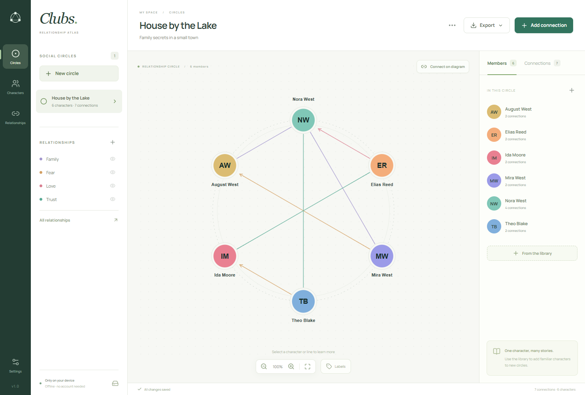
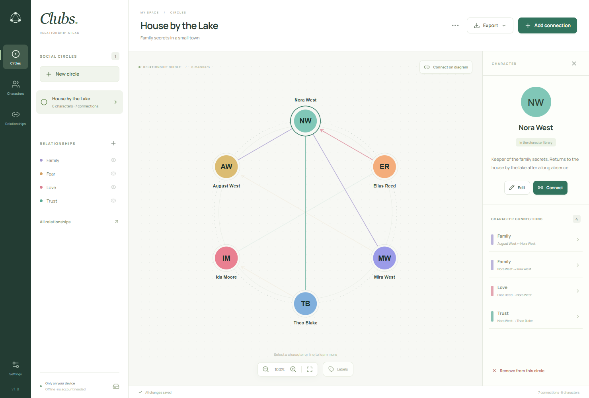
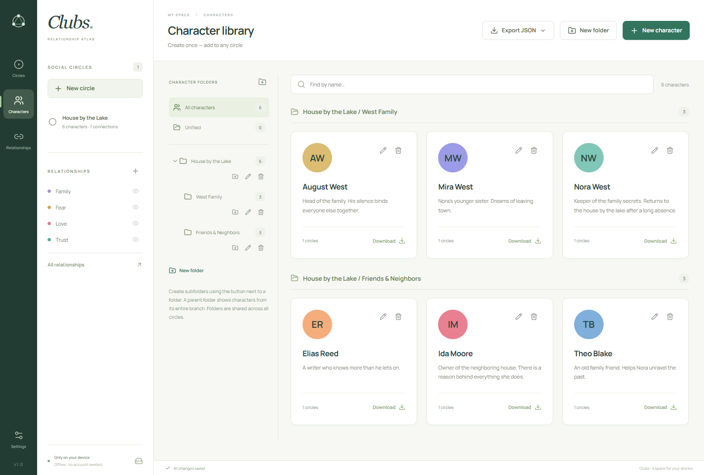
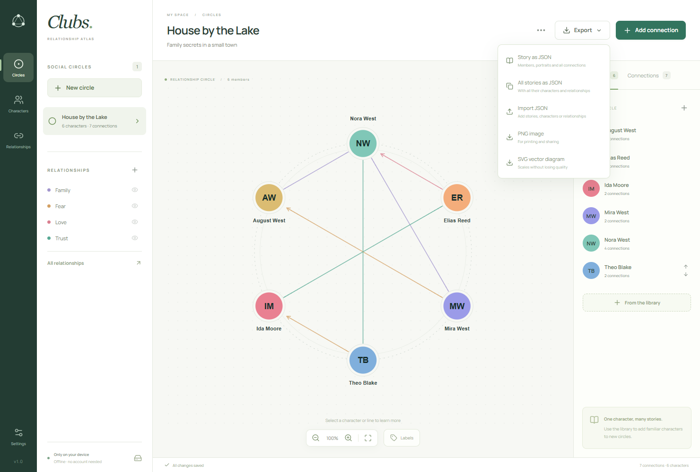

# Clubs

**See the story between your characters.**

Clubs turns a cast of characters into a visual map of relationships. Keep family ties, secret alliances, rivalries and unspoken feelings in view as you write your next chapter or prepare a tabletop session.

[**Download Clubs from Releases**](https://github.com/spechurkin/clubs/releases) · [На русском](README.ru.md)

## A whole cast, one clear picture

Each club is a space for a story, a party or a group of characters. Place your cast around the ring and connect them
with relationships you name and color yourself. Trust can be green, fear amber, love pink: the palette belongs to your
world.

Use arrows when a feeling goes one way. Add several relationships between the same pair when things get complicated. Hide a relationship type to focus on one thread, or turn on labels to read the connections directly on the map.

## Follow a character's side of the story

Select a character to highlight their connections and bring their notes into view. Select a line to see the story behind that relationship. Who does Nora trust? Who loves her without saying so? The answers stay beside the map while you work.

## Build a cast you can return to

Give each character a portrait and notes, or start with a name and colored initials. Crop, zoom, rotate and flip portraits to get the look you want.

Your character library travels across your clubs: create someone once, then bring them into another chapter, campaign or
group. Shared character details stay consistent wherever they appear. Nested folders keep families, factions and entire
worlds easy to find.

## Share the picture, keep the story

Export a club as a PNG for your players, notes or a printed handout, or choose SVG for a diagram that stays sharp at any
size. To continue working elsewhere, export a story with its characters, portraits, notes and connections included. You
can also share individual characters or a whole folder of your cast.

## From an idea to a club

1. **Meet your cast.** Add characters and a few notes about what matters to them.
2. **Name what connects them.** Create relationships that fit your story and choose their colors.
3. **Bring them together.** Create a club, add its members and connect two characters directly on the map.
4. **Explore the tension.** Follow a character's connections, focus on a relationship type and update the story as it grows.

Want to see it in action? Choose **Explore an example** inside Clubs to open _House by the Lake_, an editable story about family secrets in a small town.

## Your stories, at your pace

Clubs works offline, requires no account and keeps your stories and portraits on your device. Changes save automatically, so you can stay with the story. Back up your library whenever you want.

The interface is available in **English and Russian**, with instant switching in Settings. Your characters and notes stay as you wrote them.

[**Find your next story's home — download Clubs**](https://github.com/spechurkin/clubs/releases)
