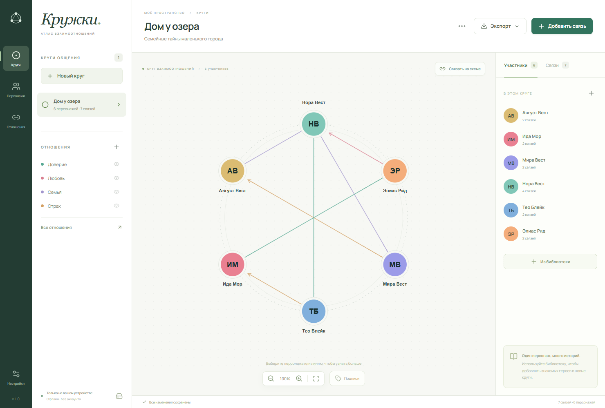
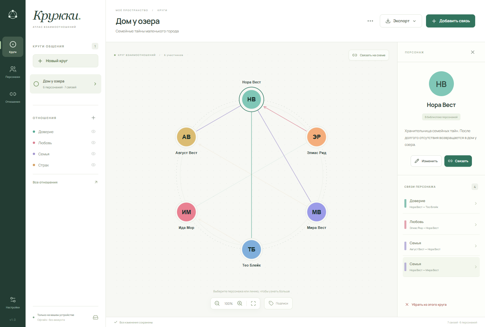
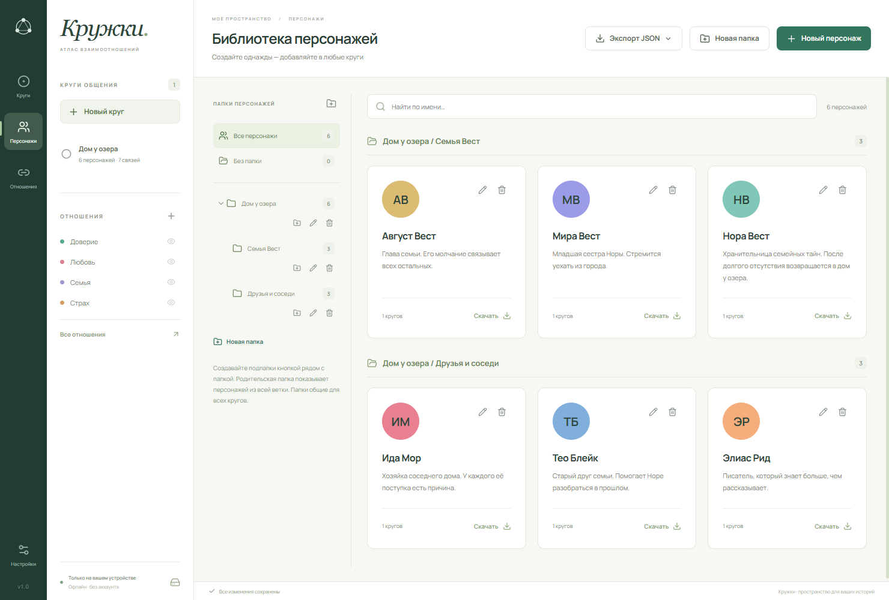
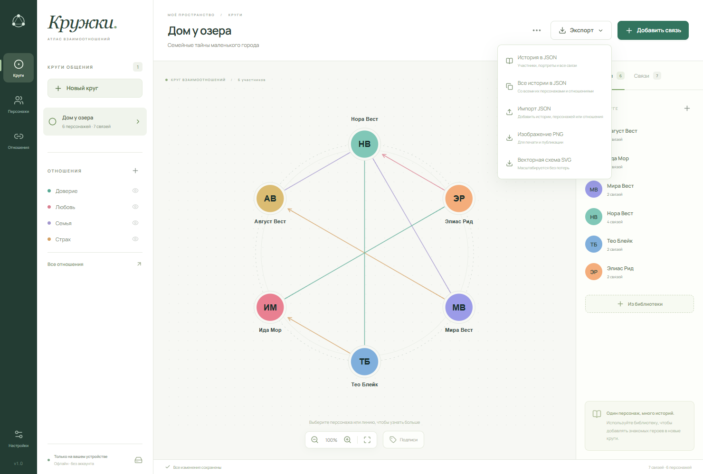

# Кружки · Clubs

**Увидьте историю между вашими персонажами.**

«Кружки» превращают список героев в наглядную карту отношений. Семейные узы, тайные союзы, соперничество и невысказанные чувства остаются перед глазами, пока вы пишете новую главу или готовите сессию настольной ролевой игры.

[**Скачать Clubs из релизов**](https://github.com/spechurkin/clubs/releases) · [English](README.md)

## Все герои — одна понятная картина

Каждый кружок — пространство для отдельной истории, игровой партии или группы персонажей. Разместите героев по окружности и свяжите их отношениями, которым сами дадите названия и цвета. Доверие может быть зелёным, страх — янтарным, любовь — розовой: палитра подстраивается под ваш мир.

Стрелки показывают чувства, которые направлены только в одну сторону. Несколько связей между одной парой передают сложные отношения. Скройте отдельный тип отношений, чтобы сосредоточиться на одной сюжетной линии, или включите подписи прямо на схеме.

## Посмотрите на историю глазами героя

Выберите персонажа, чтобы выделить его связи и открыть заметки. Нажмите на линию, чтобы прочитать, что стоит за отношением. Кому доверяет Нора? Кто любит её, но не решается признаться? Ответы остаются рядом со схемой, пока вы работаете над историей.

## Соберите героев, к которым хочется возвращаться

Добавьте персонажу портрет и заметки или начните с имени и цветных инициалов. Портрет можно кадрировать, приблизить, повернуть и отразить, чтобы выбрать подходящий образ.

Библиотека персонажей общая для всех кружков: создайте героя однажды и добавляйте его в новые главы, кампании и группы. Его описание и портрет будут одинаковыми в каждой истории. Вложенные папки помогут разложить по местам семьи, фракции и целые миры.

## Поделитесь схемой, сохраните историю

Сохраните кружок как PNG для игроков, заметок или печатной памятки. Выберите SVG, если нужна схема, которая остаётся чёткой при любом увеличении. Чтобы продолжить работу на другом устройстве, экспортируйте историю вместе с героями, портретами, заметками и связями. Можно также поделиться одним персонажем или целой папкой героев.

## От идеи к кружку

1. **Познакомьтесь с героями.** Добавьте персонажей и несколько заметок о том, что для них важно.
2. **Назовите то, что их связывает.** Создайте нужные вашей истории отношения и выберите цвета.
3. **Соберите их вместе.** Создайте кружок, добавьте участников и соедините двух героев прямо на схеме.
4. **Исследуйте напряжение.** Выделяйте связи персонажа, рассматривайте отдельные отношения и меняйте карту по мере развития истории.

Для первого знакомства нажмите **Посмотреть на примере** в приложении. Откроется «Дом у озера» — история о семейных тайнах маленького города, которую можно редактировать.

## Ваши истории в вашем ритме

«Кружки» работают офлайн, не требуют аккаунта и хранят истории и портреты на вашем устройстве. Изменения сохраняются автоматически, чтобы вы могли сосредоточиться на сюжете. Резервную копию библиотеки можно сделать в любой момент.

Интерфейс доступен на **английском и русском** и переключается сразу в настройках. Имена героев и заметки остаются такими, какими вы их написали.

[**Дайте следующей истории своё место — скачайте Clubs**](https://github.com/spechurkin/clubs/releases)
